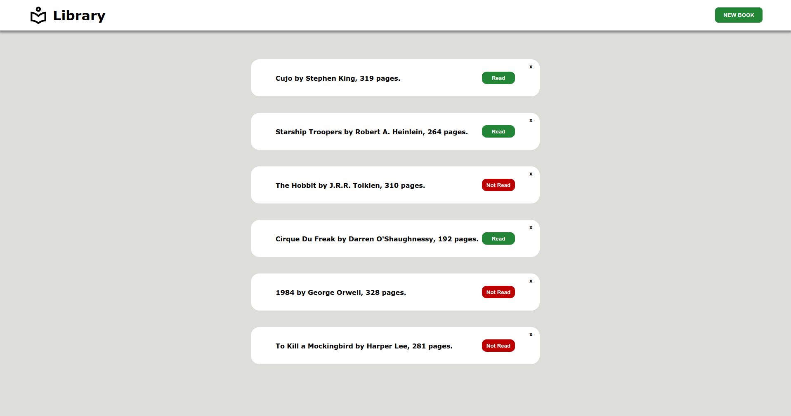

# Online Library

## Preview

## Description
* A small online library app, keep track of your favorite books!

## Made with
* HTML, CSS and JavaScript.

## Visit website
* [Link](https://jovan-nsty.github.io/library/)

## Purpose
* The purpose of this project was to build book objects from aquired form data, updating their status via Prototype and updating the DOM.

* This project was done following The Odin Project curriculum.